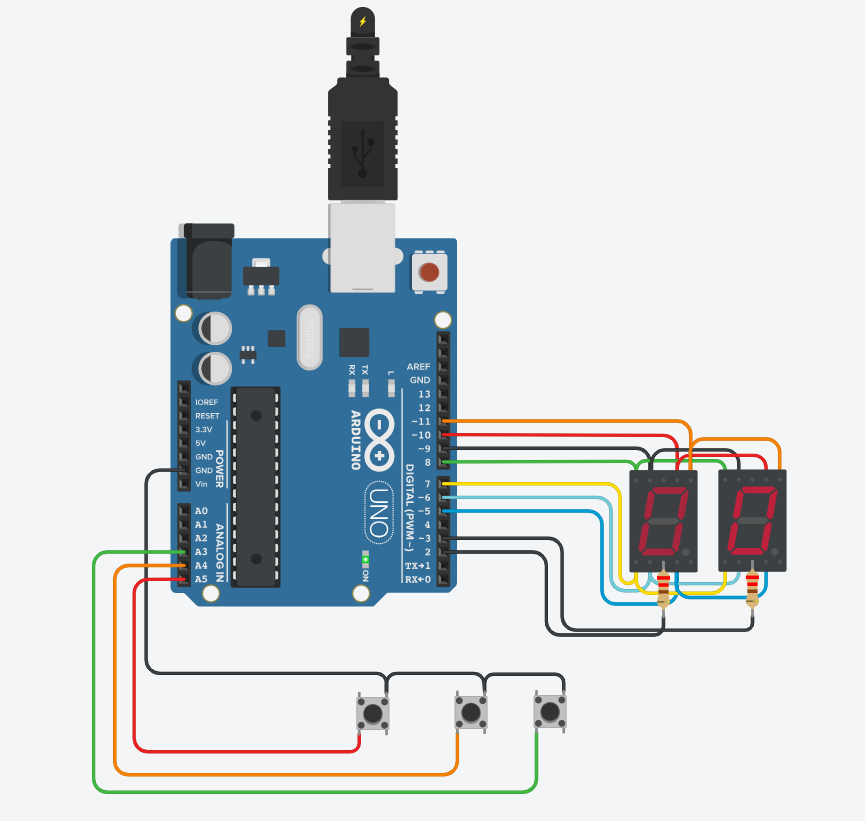

# Parcial_Domiciliario_SPD
## **Integrantes**:
 * Patricio Pereyra
 * Ailín Romano 
## Proyecto: contador de 0 a 99
#### En este proyecto se diseñó un contador de 0 a 99 en una placa de arduino con dos display de 7 segmentos cátodo común multiplexados. El mismo contiene tres botones. El primero aumenta el contador en una unidad, el segundo disminuye la cuenta en una unidad y el tercero resetea el contador en cero. Si el display llega a 99, el contador se resetea a 00.

---
## FUNCIONES
### setup()
* Esta función se ejecuta una vez al inicio del programa. Configura los pines utilizados en el circuito, tanto para la salida de datos a los displays como para la entrada de los pulsadores. Los pulsadores se configuran con resistencias pull-up internas para su detección.
### loop()
* Función principal que se ejecuta en un bucle continuo después de la configuración inicial. Controla la lógica principal del programa, que incluye alternar entre la visualización de unidades y decenas en los displays y gestionar los pulsadores para aumentar, disminuir o restablecer los valores mostrados en los displays.
### ManipularBotones()
* Esta función verifica el estado de los pulsadores y actualiza las variables que rastrean su estado anterior. Se utiliza para detectar cuándo se presionan los pulsadores de subir, bajar y restablecer.
### Subir(int pulsador, int estadoAntBoton)
* Esta función se encarga de incrementar el valor de las unidades o decenas cuando se presiona el botón de subir. Si el valor de las unidades llega a 10, se reinicia a cero y se incrementa el valor de las decenas.
